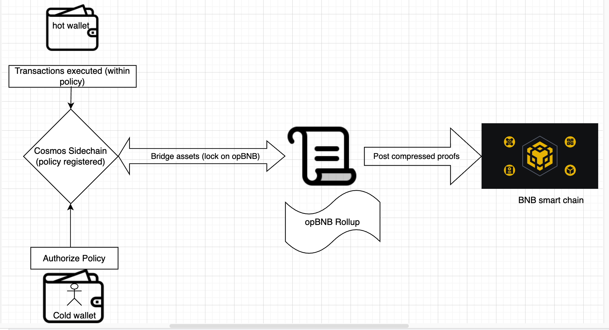

# Smart Cold Wallet Payment Hub 🛡️💸🛡️

A secure blockchain payment system enabling cold wallet users to conduct frequent transactions without exposing private keys. Leverages Cosmos SDK sidechain for policy enforcement and opBNB for asset security.

[](https://cosmos.network)
[](https://soliditylang.org)
[](https://nodejs.org)

👉 click to see Technical Details:   [Google Doc](https://docs.google.com/document/d/155oQkt5WcRJ57RKF4jdkEsh8ABcFAVg_VDo9B8x3Nbs/edit?pli=1&tab=t.0)
## Key Features ✨
- **Cold Wallet Security** - Private keys never leave offline storage
- **Delegated Spending** - Hot wallets handle transactions within policy limits
- **Instant Revocation** - Stop all transactions in 2 seconds if compromised
- **ZK Proof Integration** - Privacy-preserving transaction validation
- **Multi-Chain Architecture** - Combines opBNB scalability with Cosmos flexibility

## Architecture Overview 🏗️



## Table of Contents 📚

- [Prerequisites] (#prerequisites)
- [Installation](#installation)
- [Configuration](#configuration)
- [Services](#services)
- [Testing](#testing)
- [Deployment](#deployment)
- [Contributing](#contributing)
- [License](#license)

## Prerequisites 🛠️
- Node.js 18.x
- Go 1.20+
- Solidity Compiler 0.8.0+
- Cosmos SDK 0.46
- Docker 20.10+
- Git 2.35+

## Installation ⚙️
```
## Install dependencies
```plaintext
npm install
make install-deps
```

```text
smart-cold-wallet-payment-hub/
├── contracts/
│   ├── opBNB/
│   │   ├── ColdWalletBridge.sol
│   │   ├── SpendingPolicyManager.sol
│   │   └── interfaces/
│   │       └── IERC20.sol
│   └── sidechain/
│       ├── WrappedOpBNB.sol
│       └── DelegatedWalletModule.sol
│
├── services/
│   ├── bridge-service/
│   │   ├── index.js
│   │   ├── event-listeners.js
│   │   └── cosmos-client.js
│   ├── delegate-service/
│   │   ├── index.js
│   │   ├── spending-handler.js
│   │   └── cosmos-utils.js
│   └── zk-service/
│       ├── index.js
│       ├── proof-generator.js
│       └── circuit.zkey
│
├── cosmos-sidechain/
│   ├── app/
│   │   ├── app.go
│   │   └── cmd/
│   ├── x/
│   │   └── coldwallet/
│   │       ├── keeper/
│   │       ├── types/
│   │       └── module.go
│   └── proto/
│       └── coldwallet/
│           └── tx.proto
│
├── abi/
│   ├── ColdWalletBridge.json
│   └── SpendingPolicyManager.json
│
├── migrations/
│   └── 1_deploy_contracts.js
│
├── test/
│   ├── unit/
│   │   ├── contracts.test.js
│   │   └── services.test.js
│   └── integration/
│       └── full-flow.test.js
│
├── config/
│   ├── opbnb.json
│   └── cosmos.json
│
├── scripts/
│   ├── deploy-contracts.sh
│   └── init-sidechain.sh
│
├── docs/
│   ├── ARCHITECTURE.md
│   └── WORKFLOWS.md
│
├── .env
├── package.json
└── README.md

```

## Compile contracts
```plaintext
npm run compile:contracts
```
Build Cosmos sidechain
```plaintext
make build-cosmos
```

## Configuration ⚙️
```plaintext
Create `.env` file:
OPBNB_RPC_URL="https://opbnb-mainnet-rpc"
COSMOS_RPC_URL="localhost:26657"
BRIDGE_OPERATOR_PRIVATE_KEY="0x..."
COSMOS_MNEMONIC="word1 word2 ... word24"

```

## Services 🖥️
| Service | Port | Description |
|---------|------|-------------|
| Bridge  | 3000 | Handles cross-chain asset transfers |
| Delegate| 3001 | Executes policy-compliant transactions |
| ZK Proof| 3002 | Generates/verifies privacy-preserving proofs |

Start all services:

## Testing ✅
```plaintext
Run unit tests
npm test
```
# 🚀 Future Improvements

### 1. 🔄 Multi-Chain Support with Cross-Chain Atomic Swaps

**Description:**  
Enable users to seamlessly transfer assets across multiple blockchain networks (e.g., Ethereum, Polkadot, Solana) using decentralized cross-chain protocols like Cosmos IBC and Polkadot’s XCMP. No need for centralized bridges or intermediaries.

**Benefits:**
- **Interoperability:** Manage assets across chains in one platform.
- **Efficiency:** Atomic swaps ensure secure and trustless transactions that either fully execute or fail.

---

### 2. 🔐 Multi-Signature Wallet Support

**Description:**  
Enhance wallet security through multi-signature functionality. Both cold and delegate wallets can be protected by requiring multiple parties to approve transactions.

**Benefits:**
- **Security:** Prevents unauthorized actions by requiring multi-party approval.
- **Collaboration:** Enables shared custody of wallets for teams or organizations.

**Implementation Steps:**
- 🔧 Update policy contracts to support multi-signature logic.
- 🔗 Integrate or develop compatible multi-sig wallets.
- 🖥️ Update the UI for multi-sig setup and management.

---

### 3. 🛎️ Real-Time Transaction Notifications

**Description:**  
Implement a notification system to alert users of any transaction or policy change, ensuring transparency and enabling quick responses.

**Benefits:**
- **User Awareness:** Stay informed about wallet activity in real time.
- **Security:** React quickly to suspicious or unauthorized events.

**Implementation Steps:**
- ⚙️ Build a notification backend using WebSockets or Webhooks.
- 🔗 Integrate notifications with transaction processing logic.
- 📲 Add UI elements for viewing and managing notifications.

---

### 4. 🖼️ Support for NFTs and Other Digital Assets

**Description:**  
Support a wide range of digital assets including NFTs, making the platform more versatile for collectors and decentralized applications.

**Benefits:**
- **Versatility:** Manage both fungible tokens and NFTs in a single wallet.
- **Market Opportunity:** Tap into NFT and digital collectibles ecosystems.

**Implementation Steps:**
- 🔧 Update smart contracts to handle NFT standards (e.g., ERC-721, ERC-1155).
- 🧩 Integrate or develop NFT-compatible wallets.
- 🖼️ Update the UI to display and manage NFTs and other unique assets.

---

## 📚 Documentation

Coming soon: detailed developer and integration docs.

## 💬 Community & Support

- Twitter: [@YourProject](https://twitter.com/)
- Discord: [Join Our Community](https://discord.gg/)
- Docs: [docs.yourproject.com](https://docs.yourproject.com)

---

## 🛠️ Tech Stack

- Cosmos SDK & IBC
- opBNB / BNB Chain
- Tendermint
- Web3 / EVM / NFT standards
- WebSockets / Webhooks for real-time events

---